#  UTOPIA ENGINE

A solitaire dice game of reconstructing the end of time by Nick Hayes 2011

##  COMPONENTS

Pencil and eraser Two six-sided dice Adventure Sheet Rulebook

“Doomsday is coming. The God’s Hand cannot help us any longer; its energy requirement is far too great. The grand wizards’ paranoia and back-biting will fail to develop a useful defense. Our only hope lies in the divine power of Ancient technology. We must reconstruct the Utopia Engine!”

- Great Artificer Nereus, to the Council of Reason

##  STORY

In this game you play as Isodoros, a talented Artificer who has been charged with reconstructing a fabled device called the Utopia Engine. The Utopia Engine is an assembly of several powerful artifacts, called Constructs, that sustained an idyllic society millennia ago. Using years of research based on scraps of crumbling texts, you have finally deduced the locations of the Engine's six primary Constructs. Your guild believes that these six Constructs are enough to reactivate the Utopia Engine. All that's left is for you is to recover them, activate their internal energies, and reassemble the Engine.

Standing in your way are unscrupulous leaders, deadly terrain, and violent creatures, but even more pressing is the fast approaching Doomsday. For generations a machine known as the God's Hand, the pride of the Artificers, had been staying the apocalypse. But now that the end is so close, the device is failing. It is believed that the ancient Utopia Engine is the only way left to avert the apocalypse. You have two weeks to reconstruct and activate the Engine. If you fail, the world will be destroyed.

##  GOAL OF THE GAME

Your goal is to activate the Utopia Engine before Doomsday arrives. To do this you must search six deadly regions to find the six Constructs that make up the Utopia Engine. After finding the Constructs, you must activate them and assemble them into the Utopia Engine. Only after you've reassembled the Engine can you finally attempt to bring it to life and avert the apocalypse.

Time will be a constant pressure. However, you may be able to produce enough excess energy by activating Constructs to power the God's Hand device for a short time. This will briefly delay Doomsday, which may give you the time you need to complete your task. You are also equipped with a tool belt carrying three personal artifacts to help you in your quest.

If you die in wilderness or fail to activate the Utopia Engine in time, the game ends and you will earn a number of points based on your progress.

“Recovering the Utopia Engine is the single most important endeavor of our lives. Imagine a device able to rid the world forever of thievery, murder, and war... It will create a perfect society, and we will finally be able to attain the same greatness as the Ancients.”

- Euclaiedes, Founder of the Guild of Ancient Technology

#  SET UP

Print both adventure sheets, gather a pencil with an eraser and two dice.

#  THE ADVENTURE SHEETS

The adventure sheets are what you use to record information while you play Utopia Engine. This game comes with two illustrated adventure sheets and one low-ink version.

Adventure sheet one depicts the wilderness, where you will be doing all of your searching. It also contains important game information like the time track, hit point vial, and component stores. Adventure sheet one should be positioned vertically on top of Adventure sheet two. Simply slide the top sheet to the left or right to make the combat or search sidebars visible when you need them.

Adventure sheet two depicts your artifact workshop. Place it on top of sheet one when you are ready to work on the Constructs you have found. The top portion of adventure sheet one should remain visible while you are in your workshop.

The low-ink adventure sheet is a bare-bones, single page document designed for seasoned players and meant to be easy on your printer. Because it assumes you already know most of the game's rules, it's not recommended for first-time players.

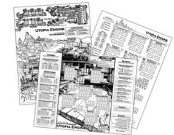

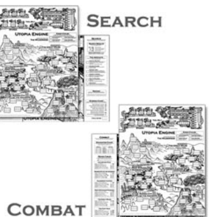

##  HOW TO PLAY

When the game begins you have only one action available: Search. If your search goes well you might find useful items or even a Construct. But if it goes poorly you will end up in Combat. Between searches you may Rest. Once you find a Construct, you may attempt to Activate it. After you've recovered two or more Constructs, you may attempt to Connect them. If you manage to recover all six Constructs and assemble them into the Utopia Engine, you may attempt the Final Activation in order to win the game.

It is entirely up to you how you complete your quest. With the exception of Final Activation, you may perform these actions in whatever order you see fit.

#  SEARCHING

Begin by choosing a region to search. Pick any empty search box. Mark off the leftmost or topmost circle from the region's day tracker. Whenever you mark a circle with a -1 in it, cross off one day from the time track.

Roll both dice and enter the values into any two of the six squares in the search box. Repeat this process two more times, each time entering the dice results into any of the remaining empty squares in the search box. The result will be two 3-digit numbers. Subtract the bottom number from the top number. The difference between these numbers is your search result. You want the search result to be as close to zero as possible. Check the search result chart to see what you found! After resolving the effects of your search, you may continue to search or return to your workshop.

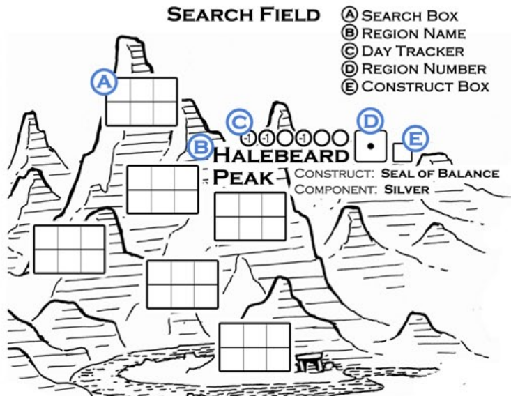

#  Extensive Search Rule

If you fill up all six search boxes in a region you may cross off one additional day from the time track to automatically find the region's Construct or one component.

Although your ultimate goal is finding the Constructs, you should also spend some time in each region gathering components. These will be necessary in assembling the Utopia Engine.

Moving between regions and/or your workshop does not use up any time. When returning to a region you have previously searched, erase all of the marks from the day tracker and search boxes before beginning your first search. There is no limit to the number of times you can visit a region.

##  SEARCH RESULT CHART

0 to 10: Find a Construct - Mark the Construct box next to the region. When you return to your workshop, you may attempt to activate it. If you get this result and you've already found that region's Construct, you find two components instead.

##  Perfect Zero Search

If you find a Construct with a perfect zero result, the Construct comes to you already activated! Add 5 energy points to the God's Hand energy bar.

You may use any search bonuses other than the Dowsing Rod, such as those gained from active Constructs or the good fortune event, to help you achieve a perfect zero result.

11 to 99: Find a Component - Add that region's component to your stores by filling in one empty circle in the component jars. You may not store more than four of any one component. Components are used in assembling the Utopia Engine.

100 to 555 or -1 to -555: Encounter - If your search results in an encounter, you must enter combat. As an old Artificer, you are not agile enough to run from battles and must rely on your weapon and luck.

##  SEARCH EXAMPLE

The frost crunches under your feet as you begin your trek into the Great Wilds.You roll both dice and get a 4 and a 5. You choose to place the 5 in the top right square (ones place) and the 4 in the bottom center square (tens place).

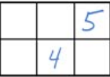

Your second roll produces two 3s. You place them in the leftmost top and bottom squares (hundreds place). This is a surefire way to make sure you get as low a number as possible.

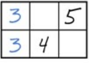

Your last roll shows a 6 and a 1. You place the six in the top square (tens place) and the 1 in the last square. Subtracting the two numbers leaves 24. You found a component!

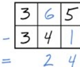

“Isodoros’ skill at artifice measures far beyond the others of your guild. We have seen the results of his modified light-bolt crossbow. We do not doubt that he can reassemble The Engine, but we do fear his aged body will not be able to withstand the trials of the wilderness.”

- The Council of Reason, to Great Artificer Nereus

##  ENCOUNTERS

You will stir up a lot of trouble if you are careless while searching for the Utopia Engine. Combat is unavoidable. When your search result is too high or two low, you attract the atten-tion of a nearby enemy.

First determine the encounter level by comparing your search result to the encounter chart. The higher or lower your search result, the more deadly the encounter will be. Once you know the encounter level, check the region's monster chart to find out what enemy you must face.

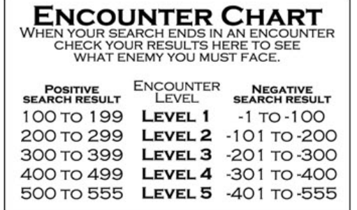

#  COMBAT

After you determine what you're fighting, combat begins. Roll both dice. Any die that matches the enemy's attack value deals one damage to you. Record the damage on your hit point vial. Any die that matches the enemy's hit value kills the enemy. Continue rolling both dice together until you kill the enemy by rolling its hit value. If

you ever get an attack and hit result at the same time, you take damage before killing the enemy. If you accumulate six or more damage, combat ends (see Unconsciousness and Death).

##  COMBAT EXAMPLE

While searching the Great Wilds you attract the attention of a wild hornback bison. It lowers its head in a territorial display. There's no backing away now; combat begins!

Dropped Items: After you defeat an enemy in combat, there is a chance it may drop a component native to that region. Roll one die. If the result is equal to or less than the encounter level, you find a component. Level 5 encounters drop powerful items instead of components (see The Legendary Treasures).

If you fall unconscious and defeat an enemy at the same time, gather the dropped items before falling unconscious.

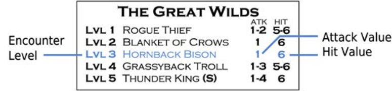

The hornback bison has an attack value of 1 and a hit value of 6. You roll two dice and get a 1 and a 4. The great hornback charges, dealing one damage to you. On your second roll the dice show a 1 and a 6. The bison manages one more blow before you vaporize it with your light-bolt crossbow.

Check to see if the animal dropped an item. You roll one die and get a 3, which is equal to the hornback bison's encounter level. You find a chunk of quartz clinging to the bison's matted fur! Add the component to your stores. You may continue searching or return to your workshop for some much needed rest.

#  RESTING

You may rest between searches to recover lost hit points. Each day you spend resting recovers one hit point. Erase the appropriate number of marks from your hit point vial and cross out the same number of days on the time track.

"The Ancients left neither sign nor record of their disappearance. If the Utopia Engine truly protected their society, how did their reign end and where did they go? The Constructs were scattered across the wilderness after the Ancients vanished. I wonder if reconstructing the device is an endeavor at which we are meant to succeed."

Artificer Myrrine, Guild of Ancient Technology

#  ACTIVATING CONSTRUCTS

You must activate each Construct before you can connect them to each other. Luckily, each active Construct will endow you with powerful abilities that will make the rest of your quest much easier (see Construct Abilities).

Begin by choosing a Construct you have already found. There are two activation fields for each Construct. If you fail to activate the Construct within the first field, it will cost you one day to move on to the second field and continue your attempt.

To activate a Construct, roll both dice and enter the values in any two of the eight squares in the activation field. As with searching, you will find the difference between the numbers in each box by subtracting the bottom number from the top number, however, this time your goal is to earn energy points by creating the largest result possible. As soon as you fill an activation box with two numbers, find the result of that box before you continue rolling.

● A result of 4 produces one energy point. Place a single mark in the result circle below the box.

● A result of 5 produces two energy points. Place two marks in the result circle below the box.

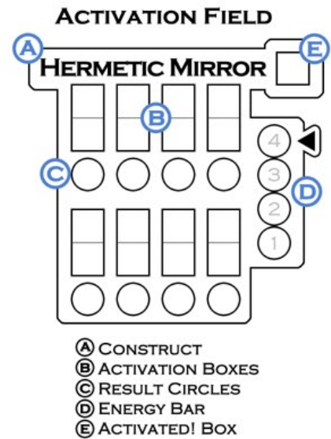

● A result of 0 resets the box. Do not place any marks in the result circle. Erase both numbers in that activation box and continue rolling.

● Any other result creates a lock. A negative result not only creates a lock, but also causes the Construct to backfire and deal one damage to you. Place an X in the result circle below the box to indicate a lock.

Continue rolling both dice, entering the values into the empty squares and finding the results of each completed box, until you've marked all four result circles. Transfer the marks to the activation bar next to the Construct to show how many energy points you produced. If you managed to accumulate four or more energy points, the Construct is activated!

If you accumulated less than four energy points, cross out one day on the time track and continue your activation attempt in the second activation field. The energy points you've already produced stay in the activa-tion bar. If you fail to accumulate four energy points after the completing the second field, cross out one more day on the time track to automatically activate the Construct.

#  Surplus Energy

If you ever accumulate more than four energy points during an activation attempt, transfer the surplus energy to the God's Hand energy bar (see The God's Hand Device).

It is possible to be knocked unconscious or even die while attempting to activate a Construct (see Unconsciousness and Death). You may choose to stop an activation attempt at any time, but you must erase any progress you made if you do.

#  RECONSTRUCTING THE UTOPIA ENGINE

You can begin connecting your active Constructs once you have collected the components necessary for each connection. This will be the first time the parts of the Utopia Engine have been reassembled since the disappearance of the Ancients. With little to no reference material on the Engine's construction, you must use your intuition and knowledge to create the most efficient connection possible between each Construct.

#  CONNECTING

You can only connect active Constructs that share a link box. Each connection requires a specific component. If you do not have the appropriate component in your stores, you cannot connect those Constructs.

#  ACTIVATION EXAMPLE

After returning home from the Great Wilds with the Hermetic Mirror safely wrapped under your cloak, you settle down at your workbench to begin the delicate task of awakening the device's dormant energies.

You roll two dice and get a 6 and a 3. You place the 6 in one of the top squares and the 3 in the bottom square of another box.

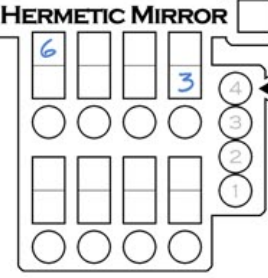

After three more rolls, the activation field is completely filled. The result of the first box is 5, which yields two energy points. The second and fourth boxes don't yield any useable results and become locked. The third box produces a zero. Erase that box and roll one more time.

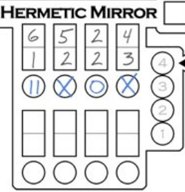

Your bonus roll gives you a 5 and a 1. You place the five on top and the 1 on bottom, giving you a 4 for one extra energy point. You managed to accumulate three energy points. Fill in three circles on the activation bar, lose one day, and move on to the next activation field.

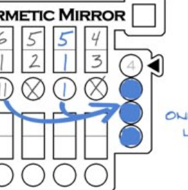

You finish the second activation field with three more energy points. One goes in the activation bar and the surplus go into the God's Hand energy bar near the time track. The Hermetic Mirror is now active!

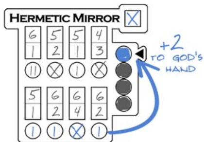

To connect two Constructs, first remove a component from your stores of the type required for that connection. Roll both dice and enter the values in any two of the six squares in the connection field.

As before, you will find the difference between the two numbers in each box, however, this time your goal is to create the smallest result possible.

#  The Waste Basket

The waste basket allows you to re-roll dice during connection attempts. If you roll a value you do not want to use, you can re-roll a die by filling in one of the ten empty circles in the waste basket. When all ten circles are filled, you are no longer allowed to make re-rolls.

Continue rolling both dice and entering the values into the empty squares until you com-plete the connection field. If you have previ-ously discarded a number to the waste basket, you may end up with an extra number after the connection field is filled. Place this extra number in the waste basket, too. If the waste basket is full, discard the number entirely. When all of the squares in the connection field are filled, subtract the bottom number from the top number in each box and write the result in the circle below.

If you create a negative result in any box, energy arcs wildly from the device, vaporizing the component you used during the connection and dealing one damage to you. You must spend another component to resume the connection. If you do, write a 2 in the result circle instead of the negative result. If you cannot spend the required component, you must erase all progress on that connection and start over after collecting more of the required component. Any numbers you put in the waste basket during that connection attempt stay there.

Once you complete the connection, add together the numbers from the three result circles and write the total in the link box beside the connection field. The lower the result, the better the connection between the two Constructs and the easier it will be to activate the Utopia Engine.

It is possible to be knocked unconscious or even die while attempting to connect two Constructs (see Unconsciousness and Death). You may choose to stop a connection attempt and resume it later, but any progress you made stays in place.

#  FINAL ACTIVATION

Once you've reconstructed the Utopia Engine by completing all six connections, you can attempt the Final Activation.

Add together the values in all six link boxes and write the total value in the final activation box. This value represents the difficulty of activating the Utopia Engine based on how efficiently you connected each Construct. The higher the number, the more difficult it will be for you to activate the Engine.

##  CONNECTION FIELD

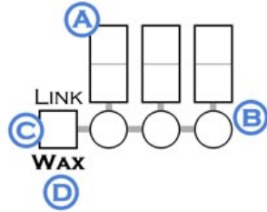

ⒶCONNECTION BOXES

® RESULT CIRCLES

C LINK BOX

Ⓓ REQ'D COMPONENT

#  CONNECTION EXAMPLE

With much work still to be done and the heat of Doomsday burning at your back, you focus your efforts on assembling the Utopia Engine. The Constructs in front of you far surpass anything even the most devoted Artificer could build today, but you must do your best to reconstruct the Ancient device.

You will be connecting the Hermetic Mirror and the Void Gate. The connection requires wax. You have two wax components in your stores. Spend one of them to begin the connection. Roll both dice. You get a 5 and a 2. You place the 5 in the top square of one box and the 2 in the bottom square of another box. Roll again.

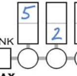

Your second roll produces two 4s. You place one 4 below the 5 and the other in the top square of the last available box. The 5 and 4 create a result of 1, which you write in the result circle under that box. Roll again.

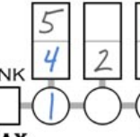

Your third roll is a 6 and a 2. You place the 2 above the other 2, creating a 0 result which you record in the result circle. If you place the 6 in the last available square below the 4, you'll have a negative result which will deal one damage to you, cost you your last wax component, and count as a result of 2. You decide to place the 6 in the waste basket and roll again.

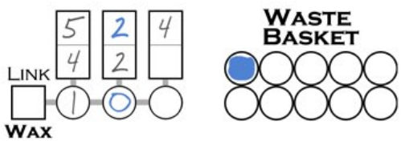

If you have enough days remaining, consider resting before you begin. Once you start the final activation attempt, you cannot stop until you succeed or die.

Begin the final activation by spending any number of your remaining hit points to permanently reduce the final activation difficulty by one for each hit point spent. In this special event, you may reduce your hit points to zero without falling unconscious.

When you are ready to continue, gather the dice. This is the most important roll of the game. Roll both dice and add the two values together. If the total is less than the final activa-tion difficulty, you failed to activate the Engine! Immediately lose one day and take one damage. If you are still alive, you must attempt the roll again.

If you manage to roll a result equal to or greater than the final activation difficulty, the Utopia Engine bursts to life in a blinding flash! The game ends immediately. After relishing your victory, tally your points (see Ending the Game and Scoring). Next time, try to beat your best score!

#  CONNECTION EXAMPLE, CONT.

Your next roll shows a 6 and a 1. Even worse! Now your options are to either use the 1 for a result of 3 or use the 6 to create a negative result that will deal one damage to you and count as a 2. You still have five more connections to make and you don't want to fill up the waste basket too early, so you decide to use the 6. A bolt of white energy shoots through your arm as the Constructs protest the faulty connection. Mark off one hit point, spend your last wax component, and fill in the result circle with a 2. Fill in an empty circle in the waste basket for the leftover 1.

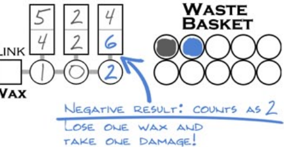

Lastly, you total the three result circles and put that value into the link box. Your link value for this connection is a 3. Once you finish the other five connections, you'll add together the values in all six link boxes to find the final activation difficulty for the Utopia Engine.

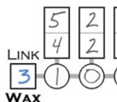

#  DOOMSDAY AND THE TIME TRACK

The end of the world will press down on you throughout the entire game. The time track records the number of days left until Doomsday. Whenever an action causes time to pass, rtecord the lost day by crossing out the next box on the time track. The boxes marked with an E are event days (see Eve

Doomsday is marked on the time track by a skull icon. When the game begins, the first skull marks the 15th day on the time track. If at any time during the game you cross out a day next to an uncrossed skull icon, the game ends in apocalypse. You can cross out skulls, and therefore delay Doomsday, by powering the God's Hand device. If you manage to cross out all eight skulls, Doomsday will occur as soon as you cross out the last day on the time track.

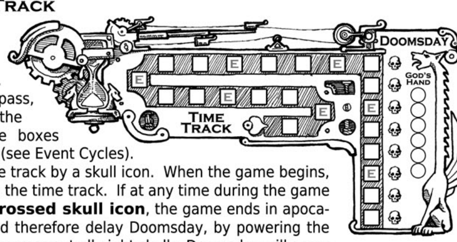

"When Euclaedes founded the Guild of Ancient Technology, its primary goal was to recover as much information on the Utopia Engine as could be found. For years his acolytes scavenged the Ruined City for handfuls of dust and wire. It took us two generations to overcome the stigma earned by his madness."

Artificer Myrrine, Guild of Ancient Technology

#  THE GOD'S HAND DEVICE

This giant artifact was modeled after the Utopia Engine in an effort to somehow recreate the limit-less, but ultimately unattainable, power of the original device. Although it is a many times inferior imita-tion, the God's Hand did have a measurable affect on staying the end of the world for generations. But as Doomsday drew closer, the machine began requiring prohibitively high amounts of power. The God's Hand now rests dormant in the guild hall, but it can still be brought back to life if you can provide enough energy.

At any time during the game you may spend three energy points from the God's Hand to delay Doomsday by one day. Record this by crossing out the topmost skull on the time track.

During Construct activation, it is possible to activate a Construct with surplus energy. Any energy points you produce beyond the four required to activate the Construct can be stored in the God's Hand energy bar. Additionally, when you find a Construct with a perfect zero search result, you can immediately add five energy points the God's Hand energy bar. The God's Hand can only hold six energy points at a time. Any surplus energy points you earn after the bar is full are discarded.

“In his later years, Euclaiedes constructed the God’s Hand based upon bits and pieces of the Utopia Engine myth. It is a faulty device borne of a faulty mind. I am uncertain that it could halt so much as a rainstorm.”

Artificer Myrrine, Guild of Ancient Technology

##  UNCONSCIOUSNESS AND DEATH

If you ever accumulate six damage on your hit point vial, you fall unconscious from your wounds. A protection amulet envelops you in an impervious barrier and teleports you to your workshop where you spend six days recovering. Erase all damage from your hit points vial and cross out six days on the time track.

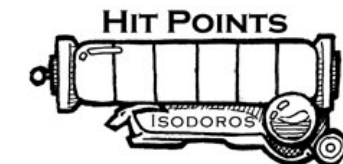

If you ever accumulate more than six damage on your hit point vial, you die instantly. There are three ways this can occur. The first is by taking two damage in combat when you only have one hit point remaining. The second is by getting more negative results during an activation or connection attempt than you have hit points remaining. The third is by failing the Utopia Engine's final activation roll while at zero hit points. If either of these situations occur, the game ends immediately. Tally your points and try to improve your score next time.

#  ENDING THE GAME AND SCORING

The game will end in one of the following ways:

● Doomsday occurs before you complete the Utopia Engine.

• You die in combat with a monster.

• You die trying to assemble or activate the Utopia Engine.

• You succeed in activating the Utopia Engine.

Regardless of how the game ends, tally your points based on the scoring chart to see how well you did. Once you tally your score, write the total in the final score box at the bottom of the adventure sheet. You might even want to write the date and save your advent- ture sheets as a record of your high score!

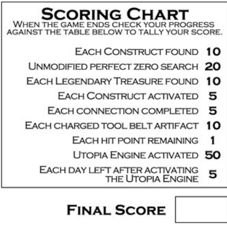

“Doomsday is inevitable. Nothing can stop it. Not your errand boy Isodoros, not your archaic machines! The only hope for our continued existence is the incorporeal transference ritual. Shed your fleshy anchor Nereus, and join us in eternity!”

-The Wizard Albedas, Order of Silver

#  EVENT CYCLES

The looming shadow of Doomsday has created a world of constant instability and imbalance. Each time you cross out an event day (marked with an 'E') on the time track, four different events, two beneficial and two hazardous, will randomly affect regions in the wilderness.

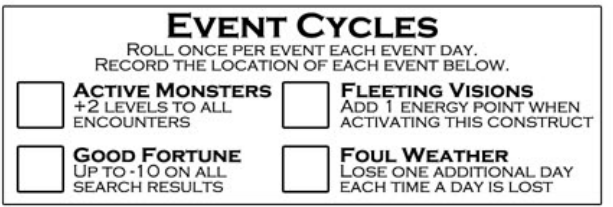

Roll a single die for each event listed on the event cycle chart and record the result in the box next to the event. This number will tell you which region is affected by that event. It is possible for a region to be affected by more than one event. Events persist in a region until a subsequent event day causes them to move to a different region.

● Active Monsters - Increase the level of all encounters in this region by two (maximum encounter level is 5).

● Fleeting Vision - Begin with one free energy point in the activation bar when activating this region's Construct. This energy point only lasts as long as fleeting visions remain in effect for the Construct or until you activate the Construct.

● Good Fortune - Subtract up to 10 from your search results in this region.

● Foul Weather - -1 circles in this region's day tracker cause you to lose two days instead of one.

If beginning a search causes you to cross out an event day, determine the locations of all four events before you begin your search rolls. Any new events in this region will affect your search roll (for example, foul weather will make you lose an additional day).

##  YOUR TOOLS

Your tool belt holds three very powerful artifacts that will help you in your search. When the game begins, each artifact has a single charge. Once you use an artifact, mark the box next to its name. It cannot be used again until recharged (see Construct Abilities: Crystal Battery).

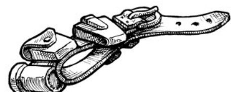

● Dowsing Rod - The Dowsing Rod is magically attuned to the dormant energies inside objects. The Dowsing Rod is best used when you are short on time and desperately need to find what you're looking for.

Effect: You may use the Dowsing Rod during a search after you've filled in an entire search box. Subtract up to 100 from your search result. The Dowsing Rod cannot reduce a search result lower than 1.

● Paralysis Wand - Emitting a focused acoustic beam, this array of crystals can be used in combat to induce muscle spasms and even full paralysis in your enemies. The Paralysis Wand is best used to overcome a powerful enemy or avoid death.

Effect: You may use the Paralysis Wand during combat to add 2 to the result of each die for the rest of the combat. You can activate the Paralysis Wand at any time during combat, even in response to a combat roll.

● Focus Charm - A powerful charm that redirects and redoubles the brain's energies to make any difficult enigma easy to solve. The Focus Charm is best used to quickly activate stubborn Constructs.

Effect: You may use the Focus Charm while activating a Construct to add two energy points to the Construct's activation bar. These marks remain until you activate the Construct. And surplus energy points may be added to the God's Hand as normal.

#  CONSTRUCT ABILITIES

Each part of the Utopia Engine is a powerful device in its own right. Even though the Constructs were forged by the Ancients' immeasurable skill, you can still activate and use their individual powers to help you in your journey. The order in which you find and activate each Construct can play an important role in the flow of your quest. Each Construct's ability will aid you in a very specific way and it's up to you to decide how and when to use each one.

● Crystal Battery - This ancient power source harmonizes and multiplies the natural vibrations of a massive array of intricately aligned crystals. Using local components, you can use the Crystal Battery to recharge your personal artifacts.

One Time Effect: If the Crystal Battery is active, you may spend any three components from your stores to recharge one of your tool belt artifacts. Use this ability only once per game.

• Void Gate - This Construct causes nearby energy barriers to react strangely.

Constant Effect: If the Void Gate is active, whenever you fall unconscious you recover to full strength in four days instead of six.

● Golden Chassis - This delicate gold device emits strange energies visible only in the spirit world. This radiation has an extremely debilitating effect on immaterial entities.

Constant Effect: If the Golden Chassis is active, add 1 to the result of each die while in combat with spirits. Spirit encounters are noted on the monster chart with (s).

• Scrying Lens - Looking through the Scrying Lens offers a glimpse into the invisible world. The range of color in the natural world explodes and the hidden becomes exposed.

Constant Effect: If the Scrying Lens is active, you may subtract up to 10 from any search result in the Glassrock Canyon or Root Strangled Marshes. This bonus can be used in conjunction with the good fortune event.

• Hermetic Mirror - The Mirror reflects that which is desired. To the untrained, this highly coveted Construct can lead to the path of insanity.

Constant Effect: If the Hermetic Mirror is active, you may subtract up to 10 from any search result in the Halebeard Peaks or The Fiery Maw. This bonus can be used in conjunction with the good fortune event.

● Seal of Balance - The Seal of Balance mitigates chaos in the natural world. Artificers believe that one of the main purposes of the Utopia Engine was to amplify the power of the Seal to work over a vast area. By itself however, the Seal is only able to restore a small region to a neutral state.

One Time Effect: If the Seal of Balance is active, you may cancel all of the events in any one region for as long as you stay there. Use this ability only once per game.

##  THE LEGENDARY TREASURES

In each region lives a monster that is both terrible and feared. Many of these creatures are the subjects of myth or legend and explorers and townsfolk speak of them hushed voices. The danger of encountering one of these monsters is immeasurable, but it is well known that they possess great treasures. If you are able to defeat one of these monsters and claim its treasure, it would be a great boon.

Each treasure is unique and owned by a specific monster. When you defeat a level 5 monster, check for dropped items as usual. If the roll is successful, the creature drops its legendary treasure instead of a component. You can only collect each treasure once, no matter how many times you encounter and defeat the monster.

• Ice Plate - The breastplate worn by the Giant of the Peaks that prevents his vengeful soul from escaping the empty cavity of his chest.

Effect: Subtract 1 from the ATK range of all monsters. For example: 1-3 becomes 1-2. Minimum ATK range is 1.

Region: Halebeard Peak

• Bracelet of los - A treasure worn by the Thunder King that is said to discharge bolts of lightning when he becomes enraged.

Effect: Add one energy point to the God's Hand each time you cross out a day on the time track.

Region: The Great Wilds

• Shimmering Moonlace - An ethereal sea plant of unknown origin that causes anything hidden within its strands to become invisible.

Effect: You may ignore encounters.

Region: Root Strangled Marshes

• Scale of the Infinity Wurm - A large, flat scale that bestows rapid healing, shed from an Ancient dietary called the Infinity Wurm.

Effect: Recover 1 hit point each time you cross out a day on the time track.

Region: Glassrock Canyon

• The Molten Shard - The blade of magma that fell from the sky and pierced the heart of the world, now lodged deep in the Fiery Maw.

Effect: Add 1 to the HIT range of all monsters. For example: 5-6 becomes 4-6.

Region: The Fiery Maw

● The Ancient Record -The ultimate treasure of the artificers, a preserved text holding the secrets of Ancient technology.

Effect: You may automatically succeed at any connection attempt. Simply spend the appropriate component and write a 1 in the link box.

“The story of our world will end in one of two ways: our salvation at the hands of the Artificers or apocalypse. If you cannot assemble the Utopia Engine in time, all that is will be destroyed. You’ve done more research on that machine than anyone alive today. You must know where the sacred parts lie. Seek them out and assemble the device, Isodoros! This hour will forever be known as the glory of the Artificer!”

- Nereus to Isodoros, three weeks before Doomsday

#  END

##  THANKS FOR PLAYING!

I hope you enjoy your time with Utopia Engine. I had a great time designing it. If you liked this game, be sure to keep your eyes peeled for more games in the Utopia Engine storyline. And as always, thanks for supporting indie game design.

Nick Hayes, designer

The designer would like to thank the many members of the BoardGameGeek.com community who helped shape and strengthen this game's design. They are (in alphabetical order): Ben Friedberg, Brandon Brooks, Brian Coppedge, Chris Benson, David Thornton, (eisenpony), Floyd Sherrod, George Buss, Joe Mucchiello, Kai Bettzieche, Kenny Ven Osdel, Murray Burgess, Robert Olesen, and Tomas Riha.

#  REFERENCE

SEARCHING PAGE 2

COMBAT PAGE 4

ACTIVATION PAGE 4

CONNECTION PAGE 5

FINAL ACTIVATION PAGE 6

##  SEARCH RESULTS

100 ~ 555 ENCOUNTER 11 ~ 99 FIND A COMPONENT 0* ~ 10 FIND A CONSTRUCT -1 ~ -555 ENCOUNTER

*PERFECT ZERO SEARCH: FIND THE CONSTRUCT ALREADY ACTIVATED AND ADD 5 ENERGY POINTS TO THE GOD'S HAND

EVENTS PAGE 9

TOOLBELT ARTIFACTS PAGE 9

CONSTRUCT ABILITIES PAGE 10

LEGENDARY TREASURES PAGE 10

##  ENCOUNTER CHART

| POSITIVE SEARCH RESULT | ENCOUNTER LEVEL | NEGATIVE SEARCH RESULT |
| --- | --- | --- |
| 100 TO 199 | LEVEL 1 | -1 TO-100 |
| 200 TO 299 | LEVEL 2 | -101 TO-200 |
| 300 TO 399 | LEVEL 3 | -201 TO-300 |
| 400 TO 499 | LEVEL 4 | -301 TO-400 |
| 500 TO 555 | LEVEL 5 | -401 TO-555 |

##  HALEBEARD PEAK

| LVL 1 | ICE BEAR | 1 | 5-6 |
| --- | --- | --- | --- |
| LVL 2 | ROVING BANDITS | 1 | 6 |
| LVL 3 | BLOOD WOLVES | 1-2 | 6 |
| LVL 4 | HORSE EATER HAWK | 1-3 | 6 |
| LVL 5 | GIANT OF THE PEAKS | 1-4 | 6 |

##  THE GREAT WILDS

| LVL 1 | ROGUE THIEF | ATK HIT1-2 5-6 |
| --- | --- | --- |
| LVL 2 | BLANKET OF CROWS | 1 6 |
| LVL 3 | HORNBACK BISON | 1 6 |
| LVL 4 | GRASSYBACK TROLL | 1-3 5-6 |
| LVL 5 | THUNDER KING (S) | 1-4 6 |

###  ROOT STRANGLED MARSHES

| LVL 1 | GEMSCALE BOA | ATK HIT |
| --- | --- | --- |
| LVL 2 | ANCIENT ALLIGATOR | 1-2 6 |
| LVL 3 | LAND SHARK | 1-2 6 |
| LVL 4 | ABYSSAL LEECH | 1-3 6 |
| LVL 5 | DWELLER IN THE TIDES | 1-4 6 |

#  GLASSROCK CANYON

| LVL 1 | FEISTY GREMLIN | ATK HIT |
| --- | --- | --- |
| LVL 2 | GLASSWING DRAKE | 1 6 |
| LVL 3 | REACHING CLAWS (S) | 1-2 6 |
| LVL 4 | TERRIBLE WURM | 1-3 6 |
| LVL 5 | LEVIATHAN SERPENT | 1-4 6 |

#  RUINED CITY OF THE ANCIENTS

| LVL 1 | GRAVE ROBBERS | ATK HIT |
| --- | --- | --- |
| LVL 2 | GHOST LIGHTS (S) | 1 6 |
| LVL 3 | VENGEFUL SHADE (S) | 1-2 6 |
| LVL 4 | NIGHTMARE CRAB | 1-3 6 |
| LVL 5 | THE UNNAMED (S) | 1-4 6 |

##  THE FIERY MAW

| LVL 1 | MINOR IMP | ATK HIT |
| --- | --- | --- |
| LVL 2 | RENEGADE WARLOCK | 1-2 5-6 |
| LVL 3 | GIANT FLAME LIZARD | 1-3 5-6 |
| LVL 4 | SPARK ELEMENTAL (S) | 1-3 6 |
| LVL 5 | VOLCANO SPIRIT (S) | 1-4 6 |

(s): indicates a spirit encounter

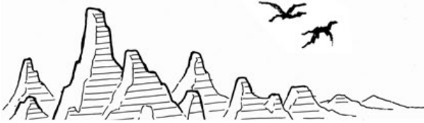

##  UTOPIA ENGINE

#  UTOPIA ENGINE: BEAST HUNTER

Across the Halebeard Peaks, far from the egotistic squabbling of the wizards and artificers of the Southern City, Mason the Hunter has made a desperate promise in order to save his own life. Healed from the edge of starvation by the elders of a frightened farming village, Mason must prove his worth by slaying the Terrible Beasts who threaten to overrun the village or face the consequences of his own unspeakable past.
